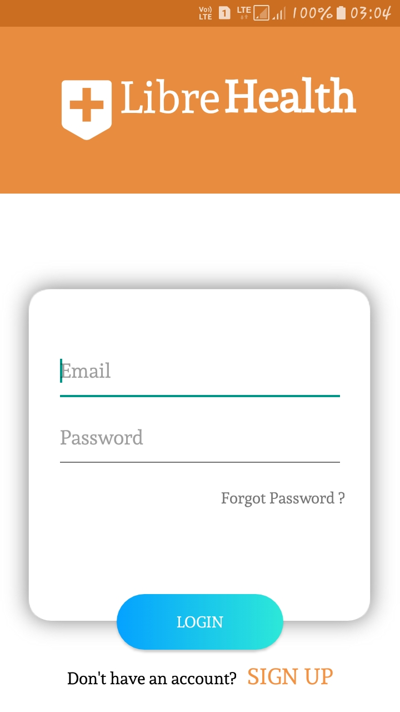
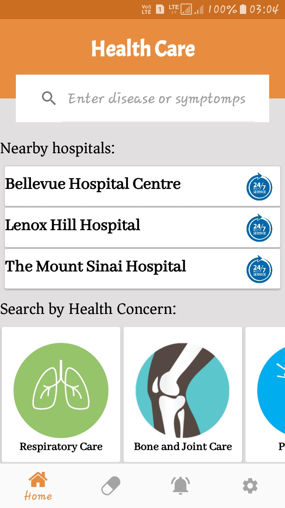
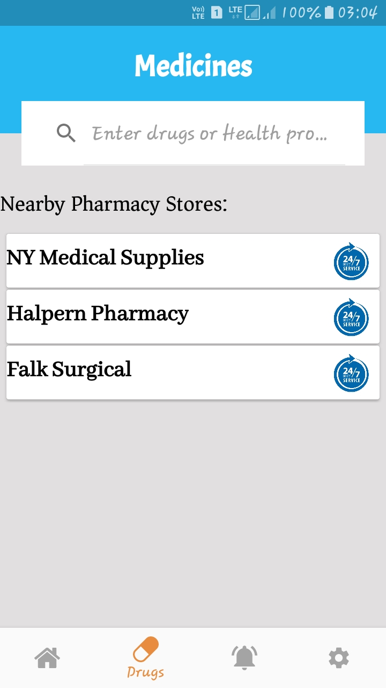
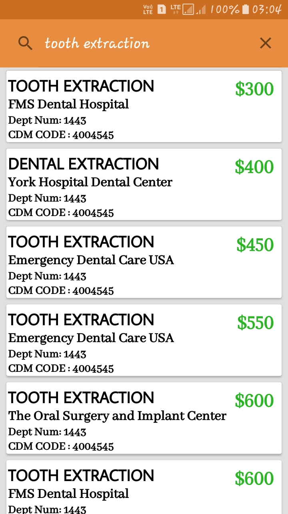

# librehealth-poc

## About
It is a prototype of an android application to show patient friendly cost of care to its users. As of now as it is only a prototype , so all the data inside the application are dummy data.

## Prerequisite
For now to login into the application you can enter any dummy data or simply click the login button to log in.

## ScreenShots
    

 
